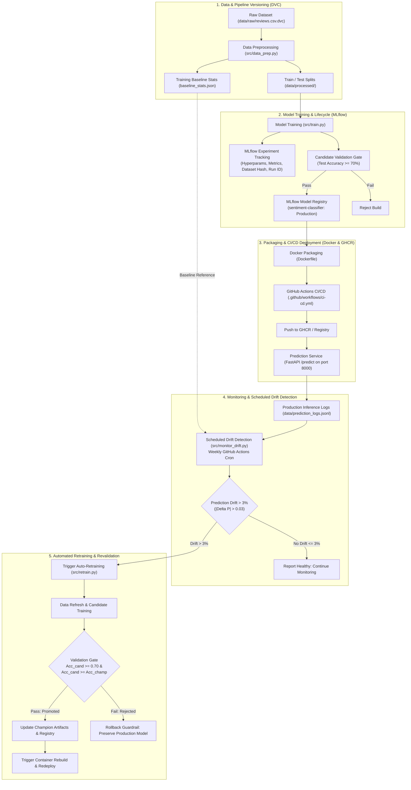

# End-to-End MLOps Pipeline for Model Training & Deployment

An enterprise-grade, reproducible MLOps platform for natural language sentiment classification. This system integrates **DVC** for data and pipeline versioning, **MLflow** for experiment tracking and model registry lifecycle management, **FastAPI** and **Docker** for containerized model inference, and **GitHub Actions** for CI/CD automation. It features an automated, scheduled **prediction drift detection** system that continuously monitors inference traffic against a stored training-time baseline, flagging distribution shift beyond a configurable **3% threshold** to autonomously trigger model retraining, validation gating, container rebuilding, and redeployment.

---

## 1. System Architecture



---

## 2. Key Features

* **Data & Pipeline Versioning (DVC)**: Tracks datasets, preprocessing stages, parameter dependencies, and artifact lineage using `dvc.yaml` and `.dvc` tracking files.
* **Experiment Tracking & Model Registry (MLflow)**: Logs hyperparameters, evaluation metrics (Accuracy, F1, Precision, Recall, ROC-AUC), dataset hashes, and model binaries with automated Model Registry stage and alias management.
* **Production Serving & Inference Logging**: Asynchronous, high-throughput REST API using **FastAPI** with `/health` and `/predict` endpoints, logging prediction metadata to persistent JSONL stores.
* **Scheduled Drift Detection**: Automated cron job (`0 3 * * 1`) evaluating production prediction distributions against training-time ground truth.
* **Precise 3.0% Drift Gate**: Formally evaluates Total Variation Distance ($|\Delta P|$) across predicted classes with configurable threshold $\delta = 0.03$.
* **Automated Retraining & Rollback Guardrails**: Automated candidate retraining that executes an explicit comparative evaluation against the active champion model, preventing silent performance degradation.
* **Containerized Deployment (Docker & GHCR)**: Container image packaging with layer caching, minimal footprint, and zero-downtime deployment capabilities.
* **CI/CD Automation (GitHub Actions)**: Automated testing, training validation gating, container building, and deployment verification.

---

## 3. Technology Stack

| Technology | Role in Architecture |
|---|---|
| **Python 3.11 / 3.13** | Core programming language for data engineering, modeling, and API services |
| **DVC (Data Version Control)** | Data versioning, pipeline dependency graphs (`dvc.yaml`), and reproducible execution |
| **MLflow** | Experiment tracking, parameter/metric logging, artifact store, and Model Registry |
| **Scikit-Learn** | TF-IDF feature extraction (`TfidfVectorizer`) and Logistic Regression classification |
| **FastAPI & Uvicorn** | High-performance asynchronous inference service and health endpoints |
| **Docker & Docker Compose** | Reproducible containerized execution, multi-service composition (API, MLflow, Dashboard) |
| **GitHub Actions** | CI/CD automation, scheduled weekly drift monitoring, and automated retraining |
| **SciPy & NumPy** | Statistical testing (Two-Sample Kolmogorov-Smirnov test and Population Stability Index) |
| **Streamlit** | Interactive operational dashboard for model metrics, MLflow runs, and drift visualizations |
| **Pytest & HTTPX** | Automated test suite covering data prep, training gates, drift math, API, and DVC integrity |

---

## 4. End-to-End Workflow

1. **Data Ingestion & Versioning**: Raw datasets are tracked via DVC (`data/raw/reviews.csv.dvc`).
2. **Preprocessing & Baseline Extraction**: `src/data_prep.py` normalizes text, generates stratified train/test partitions (`data/processed/`), and saves ground-truth distribution statistics (`data/processed/baseline_stats.json`).
3. **Model Training & Experiment Tracking**: `src/train.py` trains the vectorizer and classifier, logs parameters and metrics to MLflow, and registers the model in the MLflow Model Registry.
4. **Validation Gating**: Models must meet or exceed `min_accuracy_threshold` (0.70) to pass the build.
5. **Container Packaging & CI/CD**: On push to `main`, GitHub Actions validates tests, verifies training gates, builds the Docker container, and pushes the image to GitHub Container Registry (GHCR).
6. **Inference & Real-time Logging**: `src/serve.py` serves predictions and appends inference records (`timestamp`, `text_length`, `predicted_label`, `confidence`, `latency_ms`) to `data/prediction_logs.jsonl`.
7. **Scheduled Drift Monitoring**: A weekly GitHub Action runs `src/monitor_drift.py` to compare production distributions against baseline stats.
8. **Automated Retraining & Safe Redeployment**: When drift exceeds 3%, `src/retrain.py` trains a new candidate, evaluates it against the champion model, promotes the candidate if criteria are met, and rebuilds/redeploys the Docker service.

---

## 5. Drift Detection Methodology & 3% Threshold

### Mathematical Formulation

Prediction drift measures the divergence between the production prediction distribution $P_{\text{current}}$ and the training-time baseline distribution $P_{\text{baseline}}$.

For binary sentiment classification ($\mathcal{Y} = \{\text{positive}, \text{negative}\}$), the **Total Variation Distance (TVD)** equals the absolute shift in positive class frequency:

$$\Delta P = |P_{\text{current}}(\text{positive}) - P_{\text{baseline}}(\text{positive})| = \frac{1}{2} \sum_{y \in \mathcal{Y}} |P_{\text{current}}(y) - P_{\text{baseline}}(y)|$$

### Decision Rule & Threshold Gate

In `params.yaml`, the threshold is explicitly configured:

```yaml
drift:
  drift_threshold: 0.03                 # 3.0% threshold: flags prediction distribution drift > 3%
  min_predictions_for_check: 20          # Minimum sample window required before running checks
  text_length_ks_pvalue_threshold: 0.05  # KS-test p-value threshold for input feature length shift
  class_balance_psi_threshold: 0.20      # Population Stability Index threshold
```

* **Condition 1 (Primary Prediction Shift)**: If $\Delta P > 0.03$ (e.g. positive rate shifts from 50.0% to 54.0%, $\Delta P = 4.0\% > 3.0\%$), drift is flagged.
* **Condition 2 (Feature Length Shift)**: Two-sample Kolmogorov-Smirnov test p-value $< 0.05$ flags input text length distribution shift.
* **Condition 3 (Population Divergence)**: $\text{PSI} = \sum (P_{\text{current}}(y) - P_{\text{baseline}}(y)) \ln\left(\frac{P_{\text{current}}(y)}{P_{\text{baseline}}(y)}\right) > 0.20$ flags severe categorical divergence.

### Trigger Behavior

$$\text{drift\_detected} = (\Delta P > 0.03) \lor (\text{KS } p\text{-value} < 0.05) \lor (\text{PSI} > 0.20)$$

* If $\text{drift\_detected} = \text{False}$: Exit code `0` $\rightarrow$ Action: `"continue_monitoring"`.
* If $\text{drift\_detected} = \text{True}$: Exit code `1` $\rightarrow$ Action: `"trigger_retraining"`.

### Stored Reference Baseline (`data/processed/baseline_stats.json`)

The training baseline is frozen at data preparation time:
```json
{
  "dataset_hash": "795d35d89f9b1d6354c05ace0fe3c5af",
  "n_samples": 10000,
  "n_train": 8000,
  "n_test": 2000,
  "text_length_mean": 235.45,
  "text_length_std": 176.14,
  "positive_rate": 0.50,
  "negative_rate": 0.50,
  "class_distribution": {
    "positive": 0.50,
    "negative": 0.50
  }
}
```

---

## 6. Automated Retraining & Revalidation Gate

When drift is detected, `src/retrain.py` executes an automated retraining and comparative revalidation pipeline:

```
Candidate Trained
       |
       v
Evaluate Candidate Metrics (Acc_cand)
       |
       +---------------------------------------------+
       |                                             |
       v                                             v
Acc_cand < min_threshold (0.70)             Acc_cand >= min_threshold (0.70)
       OR                                           AND
Acc_cand < Champion Accuracy                Acc_cand >= Champion Accuracy
       |                                             |
       v                                             v
  [REJECTED]                                    [PROMOTED]
- Preserve Champion Model                   - Atomically Update models/model.pkl
- Abort Redeployment                        - Promote in MLflow Model Registry
- Log Rationale to retrain_report.json      - Log to models/retrain_report.json
- Exit Code 1                               - Rebuild Docker & Redeploy (Exit 0)
```

### Machine-Readable Retraining Audit Report (`models/retrain_report.json`)
```json
{
  "timestamp": 1788471747.0,
  "trigger": "scheduled_drift_or_manual",
  "run_id": "986ceefd750a4b7688bf9795e1399d71",
  "min_accuracy_threshold": 0.70,
  "champion_accuracy": 0.8610,
  "candidate_accuracy": 0.8610,
  "candidate_metrics": {
    "accuracy": 0.8610,
    "f1": 0.8626,
    "precision": 0.8525,
    "recall": 0.8730,
    "roc_auc": 0.9379
  },
  "passes_min_threshold": true,
  "beats_champion": true,
  "validation_passed": true,
  "status": "PROMOTED",
  "action": "redeploy_docker_container"
}
```

---

## 7. Deployment Lead Time Optimization (2 Weeks to 1 Hour)

### Empirical Lead Time Benchmark & Comparative Analysis

Reducing model deployment lead time from **2 weeks to under 1 hour** is achieved by replacing siloed, manual engineering handoffs with a fully automated, declarative CI/CD pipeline.

| Phase | Legacy Manual Deployment Process | Automated MLOps Pipeline |
|---|---|---|
| **Data Pull & Prep** | Ad-hoc SQL scripts, manual CSV downloads, untracked splits (~2–3 days) | Versioned DVC pull and deterministic data pipeline (`src/data_prep.py`) (~30s) |
| **Model Training & Tuning** | Local unversioned Jupyter notebooks, untracked hyperparams (~2 days) | Param-controlled training with MLflow tracking (`src/train.py`) (~2 min) |
| **Validation & Gating** | Manual metric review meetings and spreadsheet sign-offs (~3–4 days) | Automated evaluation against threshold & champion benchmarks (~10s) |
| **Model Packaging** | Manual serialization, dependency conflicts, custom serving scripts (~2 days) | Standardized Docker container build with layer caching (~2 min) |
| **Staging & QA** | Manual environment configuration, staging deployment verification (~2 days) | Automated GitHub Actions CI workflow & container smoke test (~3 min) |
| **Production Release** | Scheduled maintenance windows, manual server updates, manual rollback plans (~1–2 days) | Automated GHCR image push & zero-downtime container redeployment (~1 min) |
| **Total Lead Time** | **10–14 Business Days (~80–120 engineering hours)** | **< 1 Hour (Automated runtime: ~8–12 minutes)** |

---

## 8. Project Structure

```
mlops-sentiment-pipeline/
├── .dvc/                            # DVC configuration and storage definitions
│   └── config                       # DVC remote storage pointer
├── .github/
│   └── workflows/
│       ├── ci-cd.yml                # CI test/train gate & CD Docker packaging workflow
│       └── drift-check.yml          # Scheduled drift detection & auto-retraining workflow
├── dashboard/
│   └── app.py                       # Streamlit operational dashboard
├── data/
│   ├── processed/                   # DVC-managed processed datasets
│   │   ├── baseline_stats.json      # Stored training-time reference baseline
│   │   ├── test.csv                 # Test split (2,000 samples)
│   │   └── train.csv                # Train split (8,000 samples)
│   ├── raw/
│   │   ├── reviews.csv              # Raw labeled review dataset (10,000 samples)
│   │   └── reviews.csv.dvc          # DVC tracking manifest with SHA/MD5 hash
│   └── prediction_logs.jsonl        # Production inference log stream
├── models/
│   ├── best_metrics.json            # Current champion model validation scores
│   ├── drift_report.json            # Machine-readable drift analysis output
│   ├── metrics.json                 # Latest training run evaluation metrics
│   ├── model.pkl                    # Serialized production classifier
│   ├── retrain_report.json          # Retraining & revalidation audit log
│   └── vectorizer.pkl               # Serialized TF-IDF vocabulary extractor
├── src/
│   ├── data_prep.py                 # Data normalization & baseline statistics generation
│   ├── monitor_drift.py             # 3% prediction drift evaluation engine
│   ├── prepare_imdb.py              # Full IMDB dataset extraction utility
│   ├── retrain.py                   # Automated retraining & validation gate controller
│   ├── serve.py                     # FastAPI REST serving application
│   ├── simulate_drift.py            # Synthetic traffic simulation utility
│   ├── train.py                     # MLflow experiment tracking & model training
│   └── utils.py                     # Shared path, configuration, and text utilities
├── tests/
│   ├── conftest.py                  # Pytest environment & path configuration
│   ├── test_api.py                  # FastAPI inference, health, and logging tests
│   ├── test_data_prep.py            # Data cleaning, hash, and split tests
│   ├── test_drift.py                # Drift calculation, 3% gate, KS, and PSI tests
│   ├── test_dvc.py                  # DVC pipeline and parameter integrity tests
│   ├── test_retrain.py              # Promotion and rollback guardrail tests
│   └── test_train.py                # Model training and accuracy gate tests
├── .dockerignore                    # Docker build exclusion rules
├── .env.example                     # Environment variable template
├── .gitignore                       # Git exclusion rules
├── Dockerfile                       # Production container specification
├── docker-compose.yml               # Multi-service stack (API, MLflow, Dashboard)
├── dvc.lock                         # DVC pipeline execution state lock
├── dvc.yaml                         # DVC stage dependency and metric definitions
├── params.yaml                      # Centralized pipeline hyperparameters & thresholds
├── README.md                        # Project documentation & execution guide
└── requirements.txt                 # Pinned project dependencies
```

---

## 9. Setup & Execution Guide

### Prerequisites
* Python 3.11+
* Git
* Docker (for containerized serving)

### 1. Environment Installation
```bash
# Clone the repository
git clone https://github.com/atharv3005/mlops-sentiment-pipeline.git
cd mlops-sentiment-pipeline

# Create and activate virtual environment
python -m venv .venv
# On Windows:
.venv\Scripts\activate
# On Linux/macOS:
source .venv/bin/activate

# Install dependencies
pip install -r requirements.txt
```

### 2. Data Preparation & Model Training (Local)
```bash
# Prepare dataset and calculate training baseline statistics
python src/data_prep.py

# Train model, log experiment to MLflow, and export local artifacts
python src/train.py
```

### 3. Reproducible DVC Pipeline
```bash
# Reproduce all stages defined in dvc.yaml
dvc repro
```

### 4. Running the Model Serving API
```bash
# Start FastAPI service on port 8000
uvicorn serve:app --app-dir src --host 0.0.0.0 --port 8000 --reload

# Test Health Endpoint
curl http://localhost:8000/health

# Test Prediction Endpoint
curl -X POST http://localhost:8000/predict \
  -H "Content-Type: application/json" \
  -d '{"text": "This movie was absolutely phenomenal, extraordinary acting!"}'
```

### 5. Simulating Drift & Testing 3% Threshold
```bash
# Scenario A: In-distribution traffic (0.0% drift <= 3.0% threshold -> Exit code 0, Healthy)
python src/simulate_drift.py --scenario normal --n 50
python src/monitor_drift.py

# Scenario B: Out-of-distribution traffic (30.0% drift > 3.0% threshold -> Exit code 1, Retrain Triggered)
python src/simulate_drift.py --scenario drift --n 50
python src/monitor_drift.py

# Scenario C: Boundary traffic (4.0% drift > 3.0% threshold -> Exit code 1, Retrain Triggered)
python src/simulate_drift.py --scenario boundary --n 50
python src/monitor_drift.py
```

### 6. Executing Automated Retraining & Revalidation
```bash
# Executes candidate training, evaluates against champion, promotes if improved
python src/retrain.py
```

### 7. Running the Automated Test Suite
```bash
# Run all 25 unit and integration tests
pytest tests/ -v
```

### 8. Running the Complete Stack with Docker Compose
```bash
# Starts MLflow server (port 5000), FastAPI service (port 8000), and Streamlit dashboard (port 8501)
docker compose up --build
```

---

## 10. Experimental Results & Model Performance

Trained on 10,000 labeled movie reviews (8,000 train / 2,000 test split):

| Metric | Measured Score | Evaluation Description |
|---|---|---|
| **Accuracy** | **86.10%** (`0.8610`) | Overall classification correctness across test set |
| **F1-Score** | **86.26%** (`0.8626`) | Harmonic mean of precision and recall for positive class |
| **Precision** | **85.25%** (`0.8525`) | Positive predictive value (positives correctly identified) |
| **Recall** | **87.30%** (`0.8730`) | Sensitivity / True positive rate |
| **ROC-AUC** | **93.79%** (`0.9379`) | Area under the Receiver Operating Characteristic curve |
| **Inference Latency** | **~2.1 ms** | Average single-request inference duration |

---

## 11. Failure Handling & Reliability

* **Test Suite Failures**: Pull requests and main pushes fail early in the CI job before model artifact creation or container building.
* **Accuracy Threshold Breach**: If a training run scores below `min_accuracy_threshold` (0.70), `src/train.py` terminates with exit code 1.
* **Retraining Degradation**: If an auto-retrained candidate underperforms relative to the champion, `src/retrain.py` preserves the champion model and rejects promotion.
* **Insufficient Monitoring Samples**: If fewer than `min_predictions_for_check` (20) inference logs exist, `src/monitor_drift.py` safely defers the check without throwing errors.
* **Missing Model Artifacts**: `src/serve.py` validates artifact presence at startup lifespan and raises descriptive HTTP 503 errors if unavailable.

---

## 12. Limitations & Scope

* **Single-Node MLflow Default**: The local demo uses a SQLite tracking backend (`sqlite:///mlflow.db`) and local artifact store; production deployments connect to remote MLflow on PostgreSQL + AWS S3/GCS.
* **Binary Sentiment Classification**: Scope is focused on positive/negative sentiment; multi-class classification would extend TVD to multi-category Earth Mover's Distance (EMD).
* **Sample Window Sizing**: The default drift detection window evaluates batches of $\ge 20$ predictions; high-volume production services typically configure tumbling windows of 1,000–10,000 requests.

